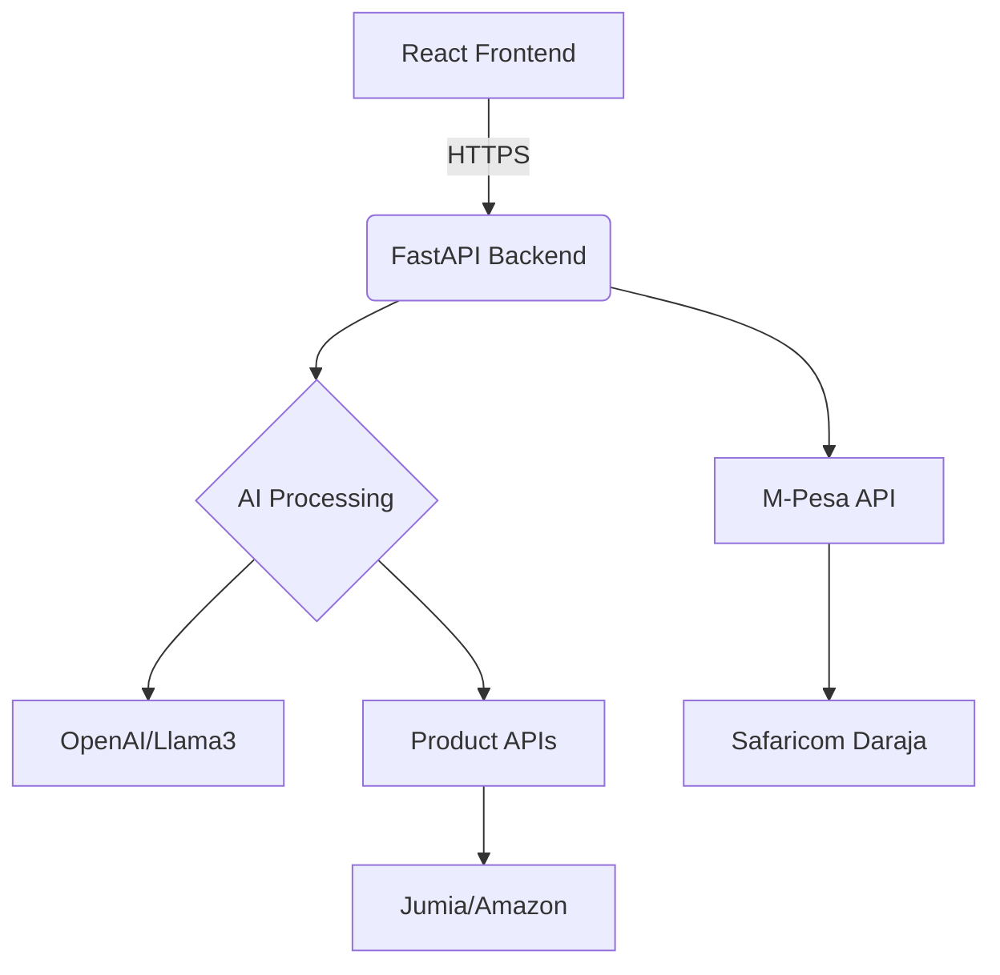

Here's the polished and properly formatted version of your README with all sections correctly organized:

```markdown
# 🖥️ AI Terminal Recommender System (AI-TRS)

[](LICENSE)
[](https://www.python.org/downloads/)
[](https://fastapi.tiangolo.com/)
[](https://swagger.io/specification/)
[](https://github.com/yourusername/ai-terminal-recommender/actions)
[](https://codecov.io/gh/yourusername/ai-terminal-recommender)
[](https://hub.docker.com/r/yourusername/ai-trss)
[](https://developer.safaricom.co.ke/)

> Terminal-style AI product recommender with natural language processing and M-Pesa tipping

---

## 🚀 Project Overview

AI-TRS is an open-source, AI-powered product recommendation platform with a command-line interface (CLI) aesthetic. It allows users to input product-related queries in any language, including slang or local dialects, and returns intelligent, contextual product suggestions from legitimate e-commerce sources. The system does not process purchases—it instead embeds product links and details. M-Pesa is integrated purely as a tipping feature for users who wish to appreciate the free service.

**Key Innovations:**
- 🤖 **Language-Agnostic Processing**: Understands queries in any language/dialect
- 🔒 **Zero-Auth Architecture**: Completely anonymous usage
- 💳 **Ethical Monetization**: Voluntary tipping only (no forced payments)

### 🎯 Core Objectives
- Provide frictionless product discovery with zero-auth requirements
- Deliver developer-friendly CLI aesthetic with modern UX principles
- Maintain privacy-first approach with no tracking
- Build open ecosystem with API-first design

---

## 🌐 System Architecture



---

## 🛠️ Tech Stack

### Core Components
| Component | Technology | Purpose |
|-----------|------------|---------|
| **Frontend** | React 18, TypeScript, TailwindCSS | CLI-style UI |
| **Backend** | FastAPI (Python 3.10+) | API services |
| **AI Engine** | OpenAI GPT-4-turbo + Llama 3 fallback | NLP processing |
| **Payments** | Safaricom Daraja API | M-Pesa tipping |
| **Caching** | Redis | Session storage |

### Key Libraries
| Category | Libraries |
|----------|-----------|
| **Python** | FastAPI, httpx, langdetect, python-mpesa |
| **Frontend** | Framer Motion, Axios, react-markdown |
| **DevOps** | Docker, Prometheus, GitHub Actions |

### 🖥️ Frontend Specifications
- **Framework**: React 18+ with TypeScript
- **Styling**: Tailwind CSS with custom animations
- **Fonts**: JetBrains Mono (monospace terminal style)
- **Themes**: Dark (#0D0D0D) and Light (#F9FAFB) modes
- **Key Features**: Typing animations, command history

---

## 📂 Project Structure

```
ai-terminal-recommender/
├── app/                          # FastAPI application
│   ├── core/                     # Config and utilities
│   ├── models/                   # Pydantic schemas
│   ├── routes/                   # API endpoints
│   └── services/                 # Business logic
├── frontend/                     # React application
│   ├── public/                   # Static assets
│   └── src/                      # Source code
├── tests/                        # Pytest suite
├── docker/                       # Docker configs
├── .github/workflows/            # CI/CD pipelines
└── README.md                     # This file
```

---

## 🚀 Deployment

### Prerequisites
- Python 3.10+
- Node.js 18+
- Redis 6.2+
- Docker 20.10+

### Quick Start
```bash
# Clone repository
git clone https://github.com/yourusername/ai-terminal-recommender.git
cd ai-terminal-recommender

# Backend setup
python -m venv venv
source venv/bin/activate
pip install -r requirements.txt

# Frontend setup
cd frontend
npm install
npm run dev

# Run with Redis
docker-compose up -d
```

### Environment Variables
```ini
# AI Configuration
OPENAI_API_KEY=your_key_here
LOCAL_LLM_ENABLED=false

# M-Pesa
MPESA_CONSUMER_KEY=your_consumer_key
MPESA_CONSUMER_SECRET=your_secret
```

---

## 📡 API Documentation

### Interactive Docs
Access Swagger UI at `http://localhost:8000/docs` or Redoc at `http://localhost:8000/redoc`

### Key Endpoints
| Endpoint | Method | Description |
|----------|--------|-------------|
| `/v1/recommend` | POST | Main recommendation endpoint |
| `/v1/clarify` | POST | Follow-up question handler |
| `/v1/tip/initiate` | POST | M-Pesa payment flow |

---

## 🔐 Security Considerations

1. **Data Protection**
   - End-to-end HTTPS encryption
   - No persistent user data storage

2. **Payment Security**
   - M-Pesa API signature verification
   - IP whitelisting for callbacks

3. **API Security**
   - Rate limiting (100 requests/min)
   - CORS restricted to frontend domains

---

## 🤝 Contributing

1. Fork the repository
2. Create your feature branch (`git checkout -b feature/amazing-feature`)
3. Commit your changes (`git commit -m 'Add some amazing feature'`)
4. Push to the branch (`git push origin feature/amazing-feature`)
5. Open a Pull Request

---

## 📜 License

Distributed under the MIT License. See `LICENSE` for more information.

---

## 📬 Contact

**Project Maintainer**  
Isaac Zachary - [izach.netlify.app](https://izach.netlify.app/)

**Project Link**  
[https://github.com/IsaacZachary/ai-terminal-recommender](https://github.com/IsaacZachary/ai-terminal-recommender)
```
